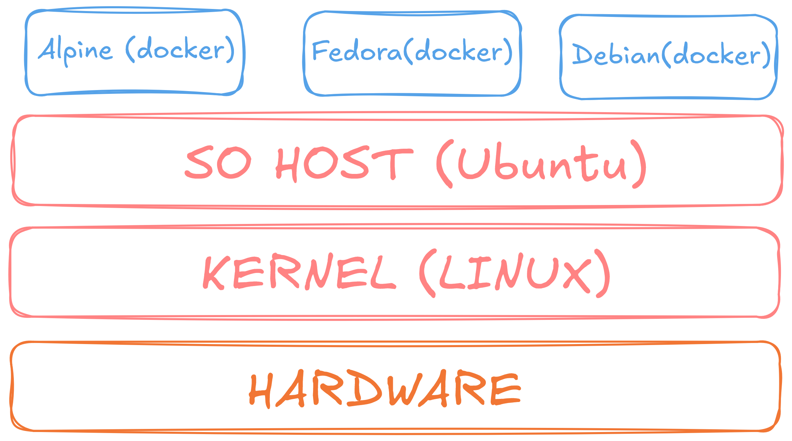

# Aprendiendo Docker
Anotaciones utiles relacionadas a docker.

## Contenido
1. [Introduccion](#introducción)
2. [Comandos para imagenes](#comandos-para-imagenes)
3. [Comandos para contenedores](#comandos-para-contenedores)
4. [Subredes de contenedores](#subredes-de-contenedores)
5. [Dockerfile](#dockerfile)


## Introducción

Docker es una **plataforma de código abierto** que permite desarrollar, desplegar y ejecutar aplicaciones dentro de **contenedores**. Estos contenedores nos permiten empaquetar proyectos incluyendo todas sus dependencias necesarias para poder replicarlas exactamente en otros equipos

### Contenedores e imágenes

- **Imágenes:** Plantillas para crear contenedores.
- **Contendores:** unidad estandarizada de software que empaqueta el 
código y todas sus dependencias.

### Funcionamiento

Docker virtualiza las aplicaciones y reutiliza el kernel del SO del host. Esto nos permite tener muchas instancias de docker corriendo en simultaneo sin consumir tantos recursos como lo haría en una VM.

Tambien nos permite tener instancias de sistemas operativos completos si comparten el mismo kernel con el SO del host. Por ejemplo, si tenemos instalada alguna distribucion de linux, podemos correr otros sistemas operativos tambien basados en Linux mediante contenedores.



## Comandos para imagenes

### Listar imágenes

Para listar todas las imágenes descargadas

```docker
docker images
```

### Descargar imágenes

Para descargar imágenes ejecutamos el comando `docker pull` con el nombre de la imagen que queremos descargar. En este caso de ejemplo se descargara una imagen de MySql.

```docker
docker pull mysql
```

En este caso, por defecto se instalara la ultima version disponible de la imagen. En caso de querer instalar una version especifica, lo indicamos agregando la `:` seguido de la version deseada

```docker
docker pull mysql:8
```

### Eliminar imágenes

Para eliminar imágenes

```docker
docker image rm mysql
```

Si queremos eliminar una version en especifica

```docker
docker image rm mysql:8
```

### Crear imagen desde Dockerfile

Para construir una imagen a partir de un archivo Dockerfile lo hacemos con `docker build`. Este comando recibe 2 argumentos.

1. El nombre de la imagen junto con su tag.
2. La ubicacion del Dockerfile.

```docker
docker build -t miapp:1.0 .
```

## Comandos para contenedores

### Crear contenedor

Para poder crear un contenedor utilizamos el comando `docker create` seguido del nombre de la imagen del contenedor. Por ejemplo, si quremos crear un contenedor apartir de la imagen oficial de MongoDB:

```docker
docker create mongo
```

⚠️ Es necesario tener la imagen instalada previamente

Al ejecutar el comando, nos devolvera el ID del contendor que nos servira para luego poder ejecutarlo:

```docker
2d8be959ed1bf3ccea6adcc19d2cd236c941d9a30a3e093345fd574462598c69
```

Docker nombra los contenedores por defecto, pero si queremos crear un contenedor con un nombre personalizado, agregamos `--name`seguido del nombre.

```docker
docker create --name manguito mongo
```

#### Abrir puertos

Si queremos permitir el acceso a conexiones desde el exterior del host debemos configurar el acceso a un puerto del host para redireccionarlo a un puerto del contenedor.

Para permitir el acceso, indicamos el puerto habilitado del host con `-p<puerto_host>:<puerto_contenedor>` .

```docker
docker create -p27017:27017 mongo
```

#### Definir red de contenedor

Para definir la red del contenedor, lo hacemos con la opción `--network` seguido del nombre de la red.

```docker
docker create --network subred mongo
```

### Iniciar contenedor

Para ejecutar un contenedor usamos el comando `docker start` seguido del ID o el nombre del contenedor

```docker
docker start 2d8be959ed1bf3ccea6adcc19d2cd236c941d9a30a3e093345fd574462598c69
```

### Ver contenedores en ejecución

```docker
docker ps
```

### Detener contenedor en ejecución

Para detener un contenedor utilizamos el comando docker stop seguido del ID o nombre del contenedor

```docker
docker stop 2d8be959ed1bf3ccea6adcc19d2cd236c941d9a30a3e093345fd574462598c69
```

### Ver todos los contenedores

Para ver todos los contenedores independientemente si están en ejecución o no:

```docker
docker ps -a
```

### Descargar, crear y ejecutar contenedor

Para poder realizar todos los procesos anteriores en un solo comando utilizamos `docker run`. Este comando se encarga de descargar la imagen (si es que no esta descargada), crear un contenedor y ejecutarlo. Para esto ejecutamos el comando seguido del nombre de la imagen.

```docker
docker run -d mongo
```

- (`-d` permite no ver los logs)

Tambien podemos aplicar las opciones anteriores para el comando `docker run`.

```docker
docker run --name manguito -p27017:27017 -d mongo
```

### Variables de entorno

El ejecutar servicios en docker, casi siempre requerirán de variables de entorno para poder configurar dichos servicios. Para definir las variables, las podemos pasar como parámetro de tipo `clave=valor` a la opción `-e`.

```docker
docker create -e clave1=valor1 -e clave2=valor2
```

Cada imagen define sus propios nombres de variables, por lo que hay que consultar la documentación para poder saberlo.


## Subredes de contenedores
Para configurar redes dentro de docker utilizamos el comando `docker network`.

### Listar redes

```docker
docker network ls
```

### Crear red

Creamos una red con el comando `docker network create` seguido del nombre de la red.

```docker
docker network create nueva-red
```

Esto nos retorna el ID de la red.

### Eliminar red

Para eliminar una red ejecutamos `docker network rm` seguido del nombre o ID de la red.

```docker
docker network rm nueva-red
```

### Comunicación

Los contenedores pertenecientes a una misma subred se pueden comunicar entres si usando como nombre de dominio el nombre del contenedor.


## Dockerfile
Un Dockerfile es un archivo de texto plano que contiene un conjunto de instrucciones para construir una imagen Docker de forma automatizada.

Permite indicarle a docker las siguientes configuraciones:

- Sistema operativo base
- Software a instalar
- Archivos a copiar
- Configuraciones a aplicar
- Comandos a ejecutar cuando se inicie el contenedor

## Ejemplo de dockerfile

```docker
FROM python:3.11-slim

WORKDIR /app

COPY python-api/ ./python-api/

RUN pip install --no-cache-dir fastapi uvicorn

EXPOSE 8000

CMD ["uvicorn", "python-api.main:app", "--host", "0.0.0.0", "--port", "8000"]
```

- `FROM`: Define la imagen base desde la que partimos, En este caso, Python 3.11 en su versión "slim" (más liviana).
- `WORKDIR`: Establece el directorio de trabajo dentro del contenedor.
- `COPY`: Copia archivos desde la máquina local al contenedor, el primer argumento es el origen (computadora) y el segundo es el destino (dentro del contenedor).
- `RUN`: Ejecuta comandos durante la construcción de la imagen, permite instalar paquetes, crear directorios, etc.
- `EXPOSE`: Documenta qué puerto usa la aplicación.
- `CMD`: Define el comando que se ejecuta cuando inicia el contenedor, solo puede haber un CMD en el Dockerfile.

Luego para crear una imagen apartir de un Dockerfile usamos el comando `docker build`.